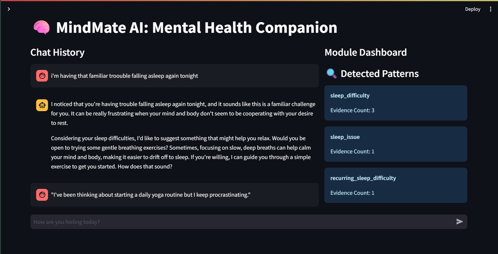
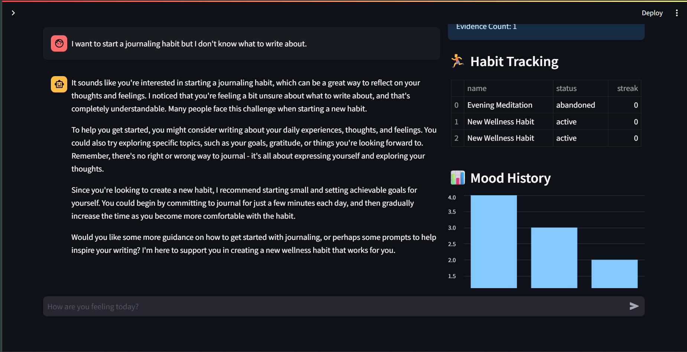
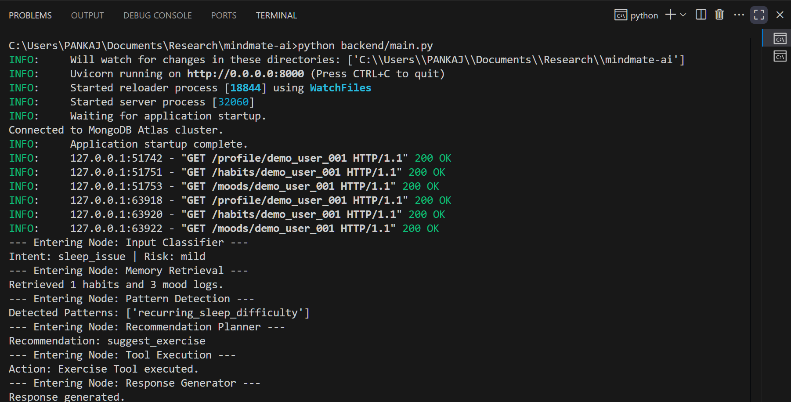

# MindMate AI: Proactive Mental Health Companion

MindMate AI is a production-grade AI Companion Orchestrator designed to unify isolated wellness modules (Mood, Habits, Journals, etc.) into an intelligent, personalized layer. It uses **LangGraph** for explicit reasoning and **PRISM-Lite** for longitudinal memory.

## 🚀 Key Features

*   **Stateful Reasoning (LangGraph):** Moves beyond simple LLM chains to a node-based architecture that handles Classification, Risk Analysis, and Tool Execution.
*   **Longitudinal Memory (PRISM-Lite):** Learns user patterns over time (e.g., recurring sleep issues) and stores them as structured intelligence in MongoDB.
*   **Hybrid Proactivity:** Initiates conversations based on background data triggers (e.g., abandoned habits) or real-time mood dips, always respecting user consent.
*   **Clinical Safety:** Implements a specialized generator node that ensures responses are empathetic, supportive, and strictly **non-diagnostic**.
*   **Real-time Intelligence Dashboard:** A dual-pane UI showing the AI's internal "Pattern Bank" alongside the chat.

## 📸 Visual Walkthrough

### 1. Unified Intelligence Dashboard
The dashboard provides a "Glass Box" view of the AI's reasoning, displaying detected longitudinal patterns, habit streaks, and mood history in real-time.


*Initial view showing PRISM-Lite patterns and empty wellness logs.*


*Active conversation showing pattern detection and bar-chart mood visualization.*

### 2. Backend Orchestration
Witness the "Brain" in action. The terminal logs show how LangGraph moves through Classification, Memory Retrieval, and Tool Execution nodes for every message.


*LangGraph node execution and tool-calling logs.*

## 🛠️ Tech Stack

*   **Agent Framework:** LangGraph + LangChain
*   **LLM:** NVIDIA LLaMA 3.3 70B Instruct
*   **Backend:** FastAPI + MongoDB (Motor)
*   **Frontend:** Streamlit
*   **Observability:** LangSmith
*   **Scheduling:** APScheduler

## 🏁 Getting Started

### 1. Prerequisites
*   Python 3.10+
*   MongoDB (Local or Atlas)
*   NVIDIA Developer API Key
*   LangSmith API Key (Optional for tracing)

### 2. Setup
```bash
# Clone the repository
git clone https://github.com/AlfaPankaj/mindmate-ai
cd mindmate-ai

# Install dependencies
pip install -r requirements.txt

# Create .env file
cp .env.example .env
# Edit .env with your NVIDIA_API_KEY, MONGODB_URI, and LANGCHAIN_API_KEY
```

### 3. Seed Demo Data
```bash
python data/seed_db.py
```

### 4. Run the System
```bash
# Start Backend (Term 1)
cd backend
python main.py

# Start Frontend (Term 2)
cd frontend
streamlit run streamlit_app.py
```

## 🧠 Architecture Deep-Dive
For detailed technical information on the LangGraph nodes, PRISM-Lite schemas, and the normalization layer, please refer to:
*   `docs/architecture.md`
*   `docs/technical_specs.md`
*   `docs/technical_explanation.md` (Code-level walkthrough)

## ⚖️ Safety & Ethics
MindMate AI follows the "Safety-First" principle. No clinical message reaches the user without passing through the Risk Classification and Clinical Persona nodes. It is designed to complement, not replace, professional therapy.
